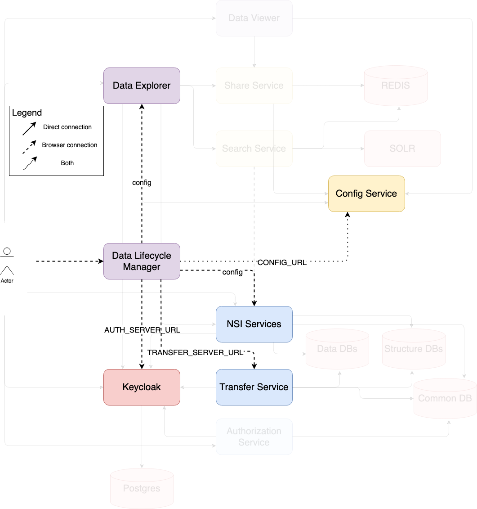
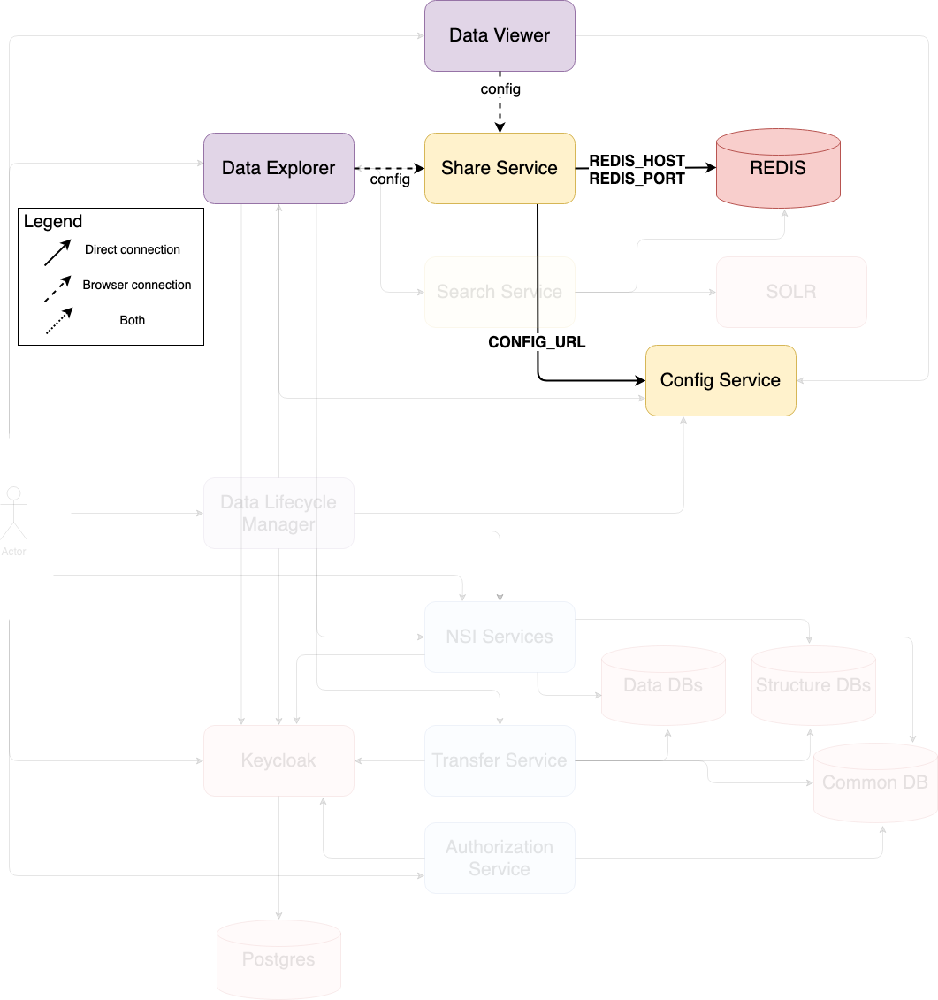

The following diagrams focus on each major component of the .Stat Suite topology as created by the demonstration files. The diagrams indicate connections between the components and the nature of the connections. They also indicate where the configuration describing the connection is set:

- **Bolded text** indicates the name of an environment variable that sets the connection URL
- lowercase unbolded text indicates the runtime source of the connection URL; usually this is `config`, indicating it is set through the configuration service.

## Note

Although many of the frontend applications (such as Data Lifecycle Manager) have a dotted line connection to the configuration service, indicating both a direct connection and one through the browser, the browser connection is solely to retrieve asset files such as images or css files.

# Data Lifecycle Manager

# Data Explorer

# Data Viewer

# SDMX Faceted Search Service

# Share Service

# NSI Services

# Transfer Service

# Authorisation Management Service

